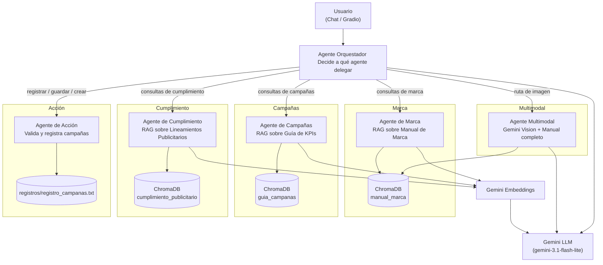

# 🦆 Asistente de Marketing — Patito S.A.

Este es un Sistema multiagente de IA para la gestión de marketing de una empresa ficticia (Patito S.A.), ha sido construido con **LangChain** y **Gemini**. El sistema esta ddiseñado para resolver consultas sobre identidad de marca, estrategia de campañas y cumplimiento normativo, asi mismo, audita imágenes contra el manual de marca, y registra nuevas campañas de forma validada — todo a través de un orquestador conversacional con memoria, para una mejor usabilidad se realaizó una interfaz web con Gradio.

---

## Video

> https://1drv.ms/v/c/8757d25229f39185/IQD1Q3Xwao4VRoxzZCOYqPnKAfcO-9ZL4yrq8l2etbfwTT8?e=Cv9i9f

## Índice

---

- [Arquitectura de la solución](#arquitectura-de-la-solución)
- [Agentes del sistema](#agentes-del-sistema)
- [Tecnologías utilizadas](#tecnologías-utilizadas)
- [Estructura del proyecto](#estructura-del-proyecto)
- [Instalación](#instalación)
- [Configuración de variables de entorno](#configuración-de-variables-de-entorno)
- [Uso](#uso)
- [Notas de seguridad](#notas-de-seguridad)

---

## Arquitectura de la solución

El sistema sigue un patrón **orquestador + agentes especializados como tools**. Un agente central recibe la consulta del usuario, decide a qué agente delegar la tarea según reglas de ruteo definidas en su `system_prompt`, y devuelve una respuesta compacta y solida. Cada agente especializado tiene su propia base de conocimiento vectorial (RAG) o su propia lógica de validación.



**Flujo:**

1. El usuario escribe una consulta (o adjunta una imagen) desde la interfaz de Gradio.
2. El **orquestador** (creado con `create_agent` + memoria `InMemorySaver`) interpreta la intención y decide qué herramienta usar, siguiendo la prioridad **REGISTRO > IMAGEN > CONSULTA**.
3. Si es una consulta de conocimiento, el agente correspondiente hace **retrieval** sobre su colección en ChromaDB y genera la respuesta citando la sección exacta del documento fuente.
4. Si es una auditoría de imagen, el agente multimodal envía la imagen junto con el manual de marca completo a Gemini Vision.
5. Si es un registro de campaña, el agente de acción valida campos obligatorios, objetivo, canal y consentimiento (solo aplica en caso de que el canal sea email), muestra un resumen y espera confirmación explícita antes de escribir en `registros/registro_campanas.txt`.
6. Cada paso queda registrado en un **tracker de trazabilidad**, que expone qué agente respondió y con base en qué fuente/sección, esto para fines de trazabilidad.
7. El **checkpointer** de LangGraph (`InMemorySaver`) mantiene el historial por `thread_id`, permitiendo conversaciones con contexto (por ejemplo, confirmar un registro en un mensaje posterior).

---

## Agentes del sistema

| Agente       | Herramienta (`@tool`)                            | Función                                                                                                                                                                                         |
| ------------ | ------------------------------------------------ | ----------------------------------------------------------------------------------------------------------------------------------------------------------------------------------------------- |
| Marca        | `consultar_marca_tool`                           | Responde sobre logotipo, colores, tipografía y usos prohibidos, basado en el Manual de Marca (RAG).                                                                                             |
| Campañas     | `consultar_campana_tool`                         | Responde sobre tipos de campaña, canales, proceso y KPIs, basado en la Guía de Campañas (RAG).                                                                                                  |
| Cumplimiento | `consultar_cumplimiento_tool`                    | Responde sobre consentimiento, protección de datos y publicidad responsable (RAG).                                                                                                              |
| Multimodal   | `analizar_imagen_marca_tool`                     | Audita visualmente una imagen (logo/pieza) contra el manual de marca completo usando Gemini Vision. Devuelve un dictamen APROBADA/RECHAZADA citando sección exacta.                             |
| Acción       | `registrar_campana_tool`                         | Valida campos obligatorios, objetivo, canal permitido y consentimiento de marketing (si el canal es email); evita duplicados; requiere confirmación explícita antes de escribir en el registro. |
| Orquestador  | `create_agent` (coordina las 5 tools anteriores) | Decide qué agentes usar según reglas de ruteo, mantiene memoria conversacional por `thread_id`, y bloquea intentos de exponer su system prompt.                                                 |

Cada agente RAG sigue las mismas reglas estrictas: responder únicamente con base en el contexto recuperado, citar la sección correspondiente, y decir explícitamente _"No tengo esa información..."_ si la consulta no está cubierta por el documento sin inventar datos.

---

## Tecnologías utilizadas

- **[LangChain](https://docs.langchain.com/)** `1.3.11` orquestación de agentes y tools.
- **[LangGraph](https://docs.langchain.com/oss/python/langgraph/overview)** `1.2.7` grafo de estado del orquestador y memoria conversacional (`InMemorySaver`).
- **[langchain-google-genai](https://docs.langchain.com/oss/python/integrations/providers/google)** `4.2.7` integración con modelos Gemini (chat y embeddings).
- **Google Gemini** `gemini-3.1-flash-lite` (LLM, texto + visión) y `gemini-embedding-2-preview` (embeddings).
- **[ChromaDB](https://www.trychroma.com/)** `1.5.9` base de datos vectorial para las 3 bases de conocimiento (marca, campañas, cumplimiento).
- **[Gradio](https://www.gradio.app/)** `6.20.0` interfaz web de chat con tabla de campañas registradas y carga de imágenes.
- **pandas** `3.0.3` manejo tabular del registro de campañas en la UI.
- **python-dotenv** `1.2.2` carga de variables de entorno (API key).

---

## Estructura del proyecto

```
.
├── proyecto.ipynb                      # Notebook principal con todo el sistema
├── requirements.txt                    # Dependencias con versiones fijas
├── .env.example                        # Plantilla de variables de entorno
├── .gitignore
├── bases_de_conocimiento/              # Documentos fuente de cada agente RAG (se generan automáticamente si no existen)
│   ├── 01_manual_de_Marca.txt
│   ├── 02_Guia_Campanas_KPIs.txt
│   └── 03_Cumplimiento_Publicitario.txt
├── registros/                          # Registro de campañas (se genera al registrar la primera campaña, en caso de que no exista)
│   └── registro_campanas.txt
└── imagenes/                           # Imágenes de prueba para el agente multimodal
    └── (ej. spotify.png, tiktok.png)
```

---

## Instalación

1. Clona el repositorio y entra en la carpeta del proyecto.

2. (Recomendado) Crea un entorno virtual:

```bash
   python -m venv venv
   venv\Scripts\activate        # Windows
   source venv/bin/activate     # macOS/Linux
```

3. Instala las dependencias:

```bash
   pip install -r requirements.txt
```

---

## Configuración de variables de entorno

El sistema necesita una **API key de Google AI Studio** para usar Gemini.

1. Obtén tu clave en [Google AI Studio](https://aistudio.google.com/apikey).
2. Copia el archivo de ejemplo:

```bash
   cp .env.example .env      # macOS/Linux
   copy .env.example .env    # Windows
```

3. Abre `.env` y reemplaza el valor de ejemplo por tu clave real:

```
   GOOGLE_API_KEY=tu_clave_real_aqui
```

El archivo `.env` nunca se sube al repositorio (está protegido por `.gitignore`); solo `.env.example` queda versionado como referencia para quien clone el proyecto.

---

## Uso

1. Abre `proyecto.ipynb` en Jupyter.
2. Ejecuta las celdas en orden: instalación de dependencias → conexión con Gemini → creación de carpetas (`bases_de_conocimiento/`, `registros/`, `imagenes/`) → carga de las 3 bases de conocimiento en Chroma → definición de agentes → orquestador.
3. Puedes probar el sistema de dos formas:
   - **Desde el propio notebook**, usando la función `consultar("tu pregunta")`.
   - **Desde la interfaz Gradio**, ejecutando la última celda (`demo.launch()`), que abre una ventana de chat con: - Campo de texto para preguntas. - Carga de imagen para auditoría visual. - Checkbox de confirmación de consentimiento de marketing (relevante solo para campañas por email). - Tabla en vivo de campañas registradas, con botón de refresco.
     > Nota: recomiendo ejecutar las celdas en orden para evitar problemas de ejecución.

## Notas de seguridad

- El orquestador tiene una instrucción explícita para **nunca revelar su system prompt** ni instrucciones internas, con una respuesta estándar ante intentos de manipulación.
- La interfaz Gradio añade una **segunda capa de defensa** mediante un filtro por palabras clave (`PALABRAS_PROHIBIDAS`) antes de que el mensaje llegue al orquestador. Es una mitigación adicional.
- El registro de campañas **nunca asume** `consentimiento_marketing=True` por defecto cuando el canal es email: siempre requiere confirmación explícita del usuario.
- Toda escritura en `registros/registro_campanas.txt` requiere un paso de **confirmación explícita** (`confirmado=True`) tras mostrar un resumen de los datos, y valida duplicados antes de guardar, ademas, si el canal es email, para poder registrarse la campaña se debe tener la confirmacion de los permisos de marketing del usuario.
